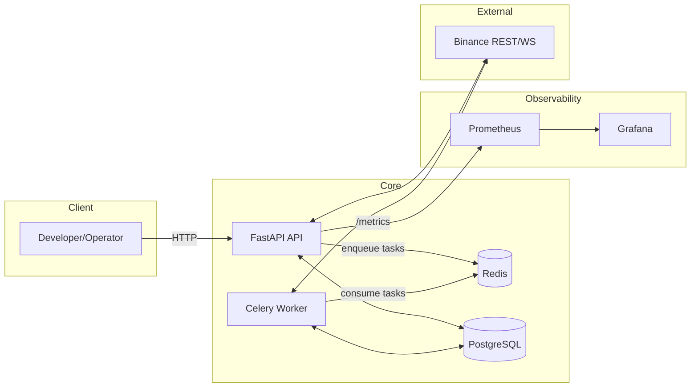

## Arquitectura del Sistema

### Diagrama de Componentes (Mermaid)

### Descripción de Componentes
- API FastAPI: expone endpoints de trading, validación, reconciliación, métricas y breakers; punto de entrada de control.
- Celery Worker: ejecuta tareas de I/O largo o intensivas (órdenes, reconciliación, cálculos ML) fuera del hilo de request.
- Redis: broker de tareas Celery y cache operativo (exchange_info, precisión, estados efímeros).
- PostgreSQL: persistencia transaccional (trades, settings, métricas agregadas opcionales).
- Prometheus: scraping de métricas del servicio (`/metrics`) y reglas de alertas.
- Grafana: visualización de KPIs (PnL, ROI, latencias, breakers, exposición).
- Binance API: fuente de datos/ejecución vía REST y WS; validaciones y reconciliación se alinean con sus filtros.

### Flujo de Datos: Ciclo de Vida de una Orden
1) Decisión de Estrategia: el motor (ML + reglas) elige estrategia y parámetros.
2) Validación Pre-Orden: contra `exchange_info` (PRICE_FILTER, LOT_SIZE, MIN_NOTIONAL, precisión) y balance suficiente.
3) Sizing: Kelly fraccional con límites; cálculo en `Decimal` para evitar errores de punto flotante.
4) Encolado: la API envía la orden como tarea asíncrona (Celery) para ejecución segura.
5) Ejecución y Tracking: el worker envía a Binance con `client_order_id`, maneja fills parciales, errores y reintentos.
6) Métricas y Logs: se registran latencias, slippage, PnL y contadores en Prometheus; logs estructurados con `order_id`.
7) Reconciliación: proceso periódico compara estado interno con Binance y corrige discrepancias (≤ 60 s).

