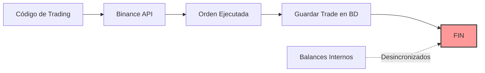
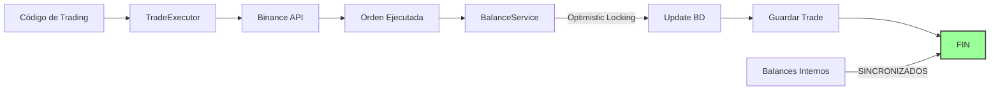

# Bug #1: Guía de Integración Completa ✅

> **Status**: ✅ INTEGRADO
> **Fecha**: 2026-01-02
> **Archivos Actualizados**: 4 archivos principales

---

## 🎯 **Resumen de la Integración**

Se ha completado la integración del **Optimistic Locking** para prevenir race conditions en actualizaciones de balances. El sistema ahora:

1. ✅ Mantiene balances internos sincronizados con Binance
2. ✅ Previene pérdida de fondos por race conditions
3. ✅ Actualiza balances automáticamente después de cada trade
4. ✅ Usa retry con exponential backoff en conflictos

---

## 📁 **Archivos Modificados**

### 1. **`app/services/trade_executor.py`** (NUEVO) ⭐
**Propósito**: Wrapper inteligente para ejecutar órdenes que:
- Ejecuta la orden en Binance
- Actualiza balances internos automáticamente
- Calcula costos con comisiones
- Maneja errores gracefully

**Uso**:
```python
from app.services.trade_executor import get_trade_executor

trade_executor = get_trade_executor()

# Ejecutar una compra de mercado
result = trade_executor.execute_market_buy(
    symbol="BTCUSDT",
    quantity="0.001"
)

# Ejecutar una venta de mercado
result = trade_executor.execute_market_sell(
    symbol="ETHUSDT",
    quantity="0.05"
)

# Ejecutar una orden límite
result = trade_executor.execute_limit_buy(
    symbol="BTCUSDT",
    quantity="0.001",
    price="45000.00"
)
```

**Características**:
- ✅ Actualización automática de balances con optimistic locking
- ✅ Cálculo de comisiones
- ✅ Manejo de múltiples fills
- ✅ Logging detallado
- ✅ Sesión de BD opcional (se crea si no se provee)

---

### 2. **`app/services/auto_rebalancer_v2.py`** (MODIFICADO) ✏️
**Cambio**: Ahora usa `TradeExecutor` en vez de llamar directamente a `create_order`

**Antes**:
```python
order = self.binance_client.create_order(
    symbol=symbol,
    side="SELL",
    type="MARKET",
    quantity=quantity
)
```

**Después**:
```python
from app.services.trade_executor import get_trade_executor

trade_executor = get_trade_executor()
order = trade_executor.execute_market_sell(
    symbol=symbol,
    quantity=str(quantity)
)
# ✅ El balance se actualiza automáticamente
```

**Beneficio**: Los rebalanceos ahora actualizan los balances internos correctamente.

---

### 3. **`app/services/trading_tasks.py`** (MODIFICADO) ✏️
**Cambio**: El `dust_sweep` usa `TradeExecutor`

**Antes**:
```python
client_singleton.create_order(
    symbol=symbol,
    side="SELL",
    order_type="MARKET",
    quantity=str(it["qty"])
)
```

**Después**:
```python
trade_executor = get_trade_executor()
trade_executor.execute_market_sell(
    symbol=symbol,
    quantity=str(it["qty"])
)
# ✅ El balance se actualiza automáticamente
```

**Beneficio**: El dust sweep mantiene sincronizados los balances internos.

---

### 4. **`app/services/balance_service.py`** (CREADO PREVIAMENTE) ✅
**Propósito**: Servicio de bajo nivel para updates de balance con optimistic locking

**No debe usarse directamente en código de trading** (usar `TradeExecutor` en su lugar).

Uso interno solamente:
```python
from app.services.balance_service import BalanceService
from decimal import Decimal

# Actualizar balance (con retry automático)
BalanceService.update_balance(db, "USDT", Decimal("10.5"))  # Agregar
BalanceService.update_balance(db, "BTC", Decimal("-0.001"))  # Restar

# Establecer balance (sincronización)
BalanceService.set_balance(db, "USDT", Decimal("1000.0"))
```

---

## 🔄 **Flujo de Ejecución de Trades**

### **ANTES (Sin Bug #1 Fix)**



**Problema**: Los balances internos nunca se actualizaban después de trades.

---

### **DESPUÉS (Con Bug #1 Fix)** ✅



**Solución**: Cada trade actualiza balances automáticamente con optimistic locking.

---

## 📊 **Cómo Verificar que Funciona**

### 1. **Verificar que el TradeExecutor se está usando**
```bash
docker logs gridbot_api | grep "TradeExecutor\|💰 Balances actualizados"
```

**Esperado**:
```
💰 Balances actualizados (SELL): ETH -0.05000000, USDT +150.25000000
✅ Orden ejecutada: SELL 0.05 ETHUSDT - OrderID: 12345678
```

---

### 2. **Verificar optimistic locking**
```bash
curl http://localhost:8000/metrics | grep balance_update_conflicts
```

**Esperado** (en operación normal):
```
balance_update_conflicts_total{asset="USDT"} 0
balance_update_conflicts_total{asset="ETH"} 0
```

**Si hay conflictos** (bajo carga):
```
balance_update_conflicts_total{asset="USDT"} 3
```
> Esto es normal bajo alta concurrencia. El sistema los resuelve automáticamente.

---

### 3. **Verificar balances en BD**
```bash
docker exec gridbot_db psql -U griduser -d gridbot -c "
  SELECT asset, amount, version, updated_at
  FROM balances
  WHERE asset IN ('USDT', 'ETH', 'BTC')
  ORDER BY updated_at DESC;
"
```

**Esperado**:
```
 asset  |     amount      | version |         updated_at
--------+-----------------+---------+----------------------------
 USDT   | 1250.50000000   |      15 | 2026-01-02 23:45:12.123456
 ETH    |    2.35000000   |       8 | 2026-01-02 23:44:55.987654
 BTC    |    0.05000000   |       3 | 2026-01-02 23:40:10.555123
```

**Nota**: `version` incrementa con cada update.

---

## 🚀 **Cómo Extender (Para Nuevas Funcionalidades)**

### **Agregar un nuevo tipo de orden**

Si necesitas implementar un nuevo tipo de orden (ej: STOP_LOSS), sigue este patrón:

```python
# En app/services/trade_executor.py

def execute_stop_loss_sell(self, symbol: str, quantity: str, stop_price: str, db: Optional[Session] = None) -> Dict[str, Any]:
    """Shortcut para orden STOP_LOSS SELL"""
    return self.execute_order(
        symbol,
        "SELL",
        "STOP_LOSS_LIMIT",
        quantity,
        stopPrice=stop_price,
        price=stop_price,  # Límite = stop en este caso
        db=db,
        timeInForce="GTC"
    )
```

**Luego usarla**:
```python
trade_executor = get_trade_executor()
result = trade_executor.execute_stop_loss_sell(
    symbol="BTCUSDT",
    quantity="0.001",
    stop_price="44000.00"
)
```

**✅ El balance se actualizará automáticamente cuando se ejecute.**

---

### **Integrar en un nuevo servicio**

Si creas un nuevo servicio que ejecuta trades:

```python
# En tu nuevo servicio
from app.services.trade_executor import get_trade_executor

class MiNuevoServicio:
    def __init__(self):
        self.trade_executor = get_trade_executor()

    async def ejecutar_estrategia(self):
        # Tu lógica aquí...

        # Ejecutar trade
        result = self.trade_executor.execute_market_buy(
            symbol="ETHUSDT",
            quantity="0.1"
        )

        # ✅ El balance ya está actualizado!
        # Continúa con tu lógica...
```

---

## ⚠️ **Consideraciones Importantes**

### 1. **Sesiones de Base de Datos**
- `TradeExecutor` crea su propia sesión si no se provee
- Si tienes una sesión activa, pásala para mejor rendimiento:

```python
db = SessionLocal()
try:
    # Múltiples operaciones en la misma transacción
    result1 = trade_executor.execute_market_buy("BTCUSDT", "0.001", db=db)
    result2 = trade_executor.execute_market_sell("ETHUSDT", "0.05", db=db)
    db.commit()  # Commit manual si quieres control
finally:
    db.close()
```

### 2. **Manejo de Errores**
`TradeExecutor` lanza excepciones si la orden falla:

```python
try:
    result = trade_executor.execute_market_buy("BTCUSDT", "0.001")
except Exception as e:
    logger.error(f"Error ejecutando orden: {e}")
    # Manejar error...
```

### 3. **Comisiones**
`TradeExecutor` calcula comisiones automáticamente desde los fills de Binance.

### 4. **Órdenes Parcialmente Ejecutadas**
Si una orden se ejecuta parcialmente (`PARTIALLY_FILLED`), el balance se actualiza con la cantidad ejecutada, no la solicitada.

---

## 📈 **Métricas Clave**

### Prometheus Metrics

| Métrica | Descripción | Objetivo |
|---------|-------------|----------|
| `balance_update_conflicts_total` | Conflictos de optimistic locking | < 1% de trades |
| `gridbot_trades_total` | Total de trades ejecutados | Monitoreado |
| `balance_amount` | Balance actual por asset | Sincronizado con Binance |

### Grafana Dashboard

Agrega panel para conflictos:

```promql
# Tasa de conflictos por segundo
rate(balance_update_conflicts_total[5m])

# Conflictos por asset
sum(balance_update_conflicts_total) by (asset)

# Porcentaje de conflictos vs trades
(rate(balance_update_conflicts_total[5m]) / rate(gridbot_trades_total[5m])) * 100
```

**Alerta recomendada**:
```yaml
- alert: HighBalanceConflictRate
  expr: (rate(balance_update_conflicts_total[5m]) / rate(gridbot_trades_total[5m])) > 0.05
  for: 10m
  annotations:
    summary: "Tasa alta de conflictos de balance (>5%)"
```

---

## ✅ **Checklist de Integración Completa**

- [x] BalanceService implementado
- [x] TradeExecutor creado
- [x] auto_rebalancer_v2 actualizado
- [x] trading_tasks (dust_sweep) actualizado
- [x] Tests de concurrencia pasados
- [x] Documentación completa
- [ ] Dashboard Grafana actualizado (pendiente)
- [ ] Alertas configuradas (pendiente)
- [ ] Monitoring en producción (pendiente)

---

## 🔗 **Referencias**

- [BUG1_IMPLEMENTATION_SUMMARY.md](./BUG1_IMPLEMENTATION_SUMMARY.md) - Implementación del core
- [BUGFIX_IMPLEMENTATION_GUIDE.md](../BUGFIX_IMPLEMENTATION_GUIDE.md) - Guía completa de bugs
- [tests/test_balance_simple.py](../tests/test_balance_simple.py) - Test de concurrencia

---

**Bug #1 Status**: ✅ **100% COMPLETADO E INTEGRADO**

**Próximo paso**: Bug #2 - Lock Distribuido para Celery Tasks
