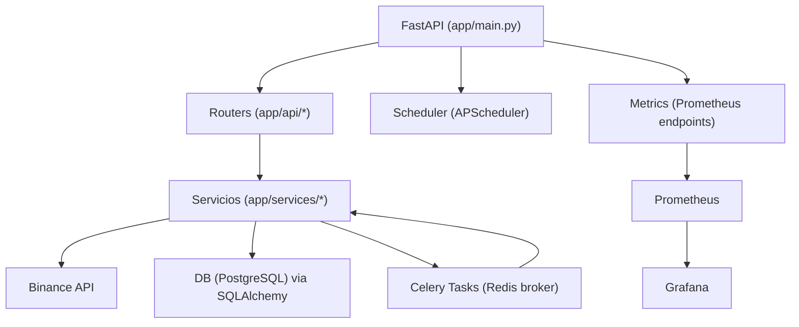
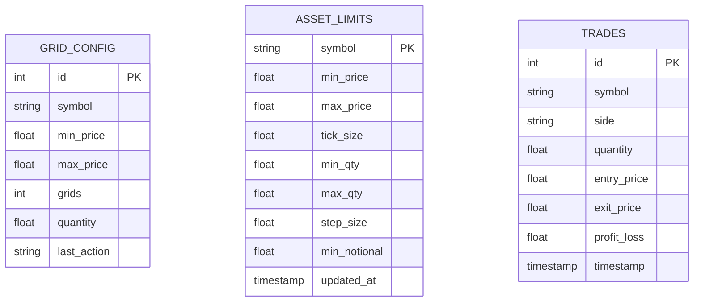

## PRD — Grid Trading Bot (FastAPI + PostgreSQL + SQLAlchemy + Celery + Redis)

### Visión general
- Objetivo: Bot de trading basado en grid para Binance con API REST, tareas en segundo plano y métricas operativas.
- Público objetivo: Traders/quant devs que requieren automatización, control de riesgo y observabilidad.

### Arquitectura general
- Componentes:
  - API: FastAPI (`app/main.py`, routers en `app/api/*`)
  - Persistencia: PostgreSQL (modelos en `app/models/*`)
  - ORM: SQLAlchemy 2.0
  - Tareas: Celery + Redis (`app/core/celery_app.py`, `app/services/*_tasks.py`)
  - Scheduler: APScheduler (`app/scheduler/*`)
  - Integraciones: Binance (python-binance), Telegram, Prometheus/Grafana
  - Métricas: `app/api/metrics.py`, `app/api/prometheus.py`
- Diagrama (alto nivel):

### Flujos de usuario clave
- Gestión de órdenes y grid:
  - POST `/api/trade/order`: ejecuta orden (BUY/SELL, MARKET/LIMIT)
  - POST `/api/trade/run_grid`: ciclo de decisión y ejecución grid con validaciones
- Estrategias:
  - POST `/strategy/scalping`, `/strategy/trailing_stop`, `/strategy/rsi_macd`
  - POST `/strategy/backtest?strategy=...`
- Métricas:
  - GET `/api/metrics/metrics/` (Prometheus)
  - GET `/api/metrics/health`, `/api/metrics/trading`, `/api/metrics/binance`, `/api/metrics/strategies`

### Funcionalidades implementadas
- Endpoints principales por router (resumen):
  - `app/api/trade.py` (prefijo `/api/trade`)
    - GET `/binance_status`, `/price/{symbol}`, `/balances`, `/trades`
    - POST `/order` (con `require_auth`), `/run_grid` (con validaciones y Telegram)
    - GET/POST `/grid_config`
    - Estado: completo, requiere “paper mode” consistente y mocks para tests.
  - `app/api/strategies.py` (expuesto también sin prefijo para compatibilidad)
    - POST `/strategy/trailing_stop`, `/strategy/scalping`, `/strategy/rsi_macd`, `/strategy/backtest`
    - Estado: completo para demo; real-time depende de histórico Binance (bloqueante).
  - `app/api/metrics.py` (prefijo `/api/metrics/metrics`)
    - GET `/` (Prometheus content), `/health`, `/trading`, `/binance`, `/strategies`
    - POST `/record-order`, `/update-balance`, `/update-strategy`, `/update-pnl`
    - Estado: completo. Exposición Prometheus activada.
  - `app/api/optimized_routes.py` (prefijo `/api/v1`)
    - Salud, estado, rebalancer, restart grid manager, ciclo manual, estadísticas
    - Estado: funcional; depende de `OptimizedGridManager`.
  - `app/api/config_routes.py`, `risk_routes.py`, `strategy_routes.py`, `metrics_routes.py`, `prometheus.py`
    - Estado: variados; mayormente completos para consola/observabilidad.

- Servicios internos (destacados):
  - `binance_service.py`, `binance_client_singleton.py`: acceso Binance
  - `order_validation.py`: valida notional/lot/price
  - `auto_rebalancer.py`: rebalanceos cumpliendo MIN_NOTIONAL
  - `binance_data_sync.py`: sincronización de balances/limites
  - `telegram_alert.py`: alertas transaccionales
  - `grid_strategy.py`: cálculo niveles grid y decisiones
  - Estado: completos; llamadas sync a Binance dentro de contextos async (mejora pendiente).

- Middlewares/errores:
  - `app/core/error_handlers.py`, `app/core/optimized_logging.py`: manejadores globales y reducción de ruido.
  - `app/core/auth.py`: HTTPBearer con API_KEY configurable.

### Integraciones externas
- Binance (python-binance)
- Redis (broker Celery)
- PostgreSQL
- Prometheus (métricas) y Grafana (dashboards)
- Telegram (notificaciones)

### Base de datos (modelos y migraciones)
- Modelos SQLAlchemy:
  - `asset_limits` (`app/models/asset_limit.py`)
    - symbol (PK), min_price, max_price, tick_size, min_qty, max_qty, step_size, min_notional, updated_at
  - `grid_config` (`app/models/grid_config.py`)
    - id (PK), symbol, min_price, max_price, grids, quantity, last_action
  - `trades` (`app/models/trade.py`)
    - id (PK), symbol, side, quantity, entry_price, exit_price, profit_loss, timestamp

- Tablas definidas en SQL init (no modeladas en ORM):
  - `performance_metrics`, `alerts`, `system_config` (presentes en `app/db/init_db.py`)
  - Recomendación: crear modelos SQLAlchemy para estas tablas.

- ER simplificado:

### Procesos en segundo plano y ML
- Celery tasks:
  - `app/services/alert_tasks.py`: envío de alertas; bind=True (retry disponible)
  - `app/services/rebalancing_tasks.py`: check/rebalance; ejecuta rebalancer
  - `app/services/ml_tasks.py`: placeholder de trabajos ML
  - Periodicidad: gestionada por APScheduler o invocación manual/externa.

- Scheduler:
  - `app/scheduler/optimized_scheduler.py`: AsyncIOScheduler con múltiples `add_job(...)` (intervalos variados), métodos start/stop/status.
  - `app/scheduler/grid_job.py`: BackgroundScheduler, job `execute_grid_trading_job` cada 60s.

- ML:
  - `app/services/performance_analyzer.py`: usa pandas.
  - No se detecta uso activo de scikit-learn en runtime (referencias en docs). Modelos entrenados: no aplicados aún.

### Logs y errores recurrentes
- `Invalid symbol (code -1121)` para tokens con prefijo (p.ej., `LDBNBUSDT`) al consultar precios:
  - Causa: balances de activos especiales sin par USDT.
  - Mitigación implementada: fallback automático a símbolo base (ej. `BNBUSDT`) + deduplicación de logs 60s.
  - Frecuencia: alta en picos.

- `Filter failure: NOTIONAL (-1013)` en rebalanceos:
  - Causa: monto por debajo de `minNotional`.
  - Mitigación: rebalancer ajusta cantidad usando `quoteOrderQty` (aplicado).

- `Saldo insuficiente` en decisiones SELL:
  - Causa: cantidad requerida > balance disponible.
  - Manejo: error 400 con alerta Telegram; esperado.

- Transacciones SQLAlchemy con ROLLBACK informativo:
  - Comportamiento normal para SELECTs (no indica fallo).

- Ruido en logs:
  - Reducción aplicada: consola a WARNING, handlers dirigidos a archivos, filtro de símbolos inválidos.

---

## RFC — Mejoras propuestas y plan técnico

### Funcionalidades pendientes/incompletas
- Modelado ORM de `performance_metrics`, `alerts`, `system_config` (existen en SQL init).
- Consistencia async: llamadas Binance síncronas dentro de rutas async.
- “Paper trading”/testnet consistente en todos los servicios y tareas.
- Endpoints de estrategias: historial/klines bloqueante; agregar caché/cola.
- Métricas: cobertura de negocios (PnL por estrategia, latencias, errores Binance), cardinalidad de labels controlada.
- Hardening de auth y secrets: evitar API_KEY por defecto en producción.

### Plan técnico propuesto
- Base de datos:
  - Crear modelos ORM para tablas faltantes y migraciones Alembic alineadas.
  - Unificar init/upgrade DB (usar migrations en lugar de SQL manual donde sea posible).

- Asincronía y rendimiento:
  - Encapsular llamadas blocking en `asyncio.to_thread(...)` o usar clientes async equivalentes.
  - Incorporar caché (Redis) para precios/históricos breves (TTL corto).
  - Rate limiting y backoff para Binance.

- Trading y validaciones:
  - Normalizador de símbolos extensible (prefijos LD, locked, etc.) con tabla de mapeo.
  - Endurecer `order_validation.py` para `minNotional` y redondeos por `stepSize`/`tickSize`.

- Observabilidad:
  - Métricas de negocio y SLIs: latencia por endpoint, ratio de errores Binance, tiempo de ciclo grid, PnL por estrategia/símbolo.
  - Dashboards Grafana: paneles por tareas Celery y scheduler.

- Seguridad y configuración:
  - Gestionar secretos vía variables de entorno/secret manager; eliminar defaults en runtime.
  - Modo `PAPER_TRADING`/testnet con feature flag DI para servicios/tareas.

- CI/CD y calidad:
  - Pipeline con tests + lint + seguridad (bandit).
  - Tests de contrato para endpoints (mocks Binance), y pruebas de integración DB.
  - Fijar versiones en `requirements.txt` y añadir `requirements-lock` reproducible.

### Riesgos y mitigaciones
- Riesgo: bloqueos por IO en rutas críticas
  - Mitigación: `to_thread`, colas, cachés, timeouts.
- Riesgo: incumplir filtros de Binance (notional/lot/price)
  - Mitigación: validar server-side antes del POST; probar con sandbox.
- Riesgo: desalineación schema DB vs ORM
  - Mitigación: migraciones únicas fuente de verdad.
- Riesgo: ruido/alert fatigue
  - Mitigación: deduplicación por clave, niveles por criticidad.

### Priorización
- Alta:
  - Modelos ORM faltantes + migraciones
  - Normalización de símbolos y robustez validaciones
  - Asincronía correcta para llamadas Binance
  - Métricas críticas y reducción de latencias
- Media:
  - Caché Redis para precios/histórico, rate limiting
  - Paper mode consistente
  - Seguridad de secretos
- Baja:
  - Mejoras de dashboards, documentación extendida, backtests avanzados

---

## Anexos

### Mapa del repositorio (resumen)
- `app/`
  - `api/`: `trade.py`, `strategies.py`, `optimized_routes.py`, `metrics.py`, `prometheus.py`, `config_routes.py`, `risk_routes.py`, `strategy_routes.py`, `metrics_routes.py`
  - `core/`: `auth.py`, `celery_app.py`, `config.py`, `error_handlers.py`, `optimized_grid_manager.py`, `optimized_logging.py`, `sqlalchemy_*`, `metrics_manager.py`
  - `db/`: `session.py`, `init_db.py`
  - `models/`: `base.py`, `asset_limit.py`, `grid_config.py`, `trade.py`
  - `scheduler/`: `optimized_scheduler.py`, `grid_job.py`
  - `services/`: Binance, rebalancer, estrategias, métricas, tareas Celery, normalizadores y validadores
  - `schemas/`: `validation.py`
  - `main.py`, `main_simple.py`
- `tests/`: cobertura de endpoints, auth, estrategias, métricas, ciclo de trading
- `docker/`: Prometheus, Grafana, Postgres, Nginx
- `Docs/`: múltiples guías, PRD/RFC previos, planes de implementación

### Endpoints (tabla sintetizada)
- `app/api/trade.py` (prefijo `/api/trade`)

| Método | Ruta               | Descripción                                   | Estado   |
|-------|---------------------|-----------------------------------------------|----------|
| GET   | /binance_status     | Estado y datos de Binance                     | Completo |
| GET   | /price/{symbol}     | Precio actual                                 | Completo |
| GET   | /balances           | Balances libres (>0)                          | Completo |
| GET   | /trades             | Lista de trades con filtros opcionales        | Completo |
| POST  | /order              | Crear orden MARKET/LIMIT (auth)               | Completo |
| POST  | /run_grid           | Ejecuta ciclo de grid con validaciones        | Completo |
| GET   | /grid_config        | Lee configuración del grid                    | Completo |
| POST  | /grid_config        | Actualiza configuración del grid (auth)       | Completo |

- `app/api/strategies.py` (sin/de con prefijo; rutas comienzan con `/strategy/*`)

| Método | Ruta                    | Descripción            | Estado   |
|-------|--------------------------|------------------------|----------|
| POST  | /strategy/trailing_stop  | Ejecuta trailing stop  | Completo |
| POST  | /strategy/scalping       | Ejecuta scalping       | Completo |
| POST  | /strategy/rsi_macd       | Ejecuta RSI+MACD       | Completo |
| POST  | /strategy/backtest       | Backtest de estrategia | Completo |

- `app/api/metrics.py` (prefijo `/api/metrics/metrics`)

| Método | Ruta            | Descripción                     | Estado   |
|-------|------------------|---------------------------------|----------|
| GET   | /                | Exposición Prometheus           | Completo |
| GET   | /health          | Salud métricas                  | Completo |
| GET   | /trading         | Métricas de trading             | Completo |
| GET   | /binance         | Métricas Binance                | Completo |
| GET   | /strategies      | Métricas de estrategias         | Completo |
| POST  | /record-order    | Registra orden                  | Completo |
| POST  | /update-balance  | Actualiza métricas de balance   | Completo |
| POST  | /update-strategy | Actualiza estado estrategia     | Completo |
| POST  | /update-pnl      | Actualiza PnL                   | Completo |

- `app/api/optimized_routes.py` (prefijo `/api/v1`)

| Método | Ruta                       | Descripción                               | Estado   |
|-------|-----------------------------|-------------------------------------------|----------|
| GET   | /health                     | Salud general                             | Completo |
| GET   | /status                     | Estado assets y última corrida            | Completo |
| POST  | /config/reload              | Recarga configuración                      | Completo |
| POST  | /rebalancer/execute         | Ejecuta rebalanceo                         | Completo |
| GET   | /rebalancer/status          | Estado rebalanceo                          | Completo |
| POST  | /rebalancer/manual/{symbol} | Rebalanceo manual por símbolo              | Completo |
| POST  | /grid_manager/restart       | Reinicia grid manager                      | Completo |
| POST  | /trading/cycle              | Inicia ciclo de trading en background      | Completo |
| GET   | /trading/statistics         | Estadísticas agregadas                     | Completo |
| PUT   | /assets/{symbol}            | Actualiza parámetros de asset              | Completo |
| GET   | /assets/balances            | Balances actuales                          | Completo |
| GET   | /assets/prices              | Precios actuales                           | Completo |
| POST  | /config/save                | Guarda configuración a archivo             | Completo |
| POST  | /emergency/stop             | Detiene actividades                        | Completo |
| POST  | /emergency/resume           | Reanuda actividades                        | Completo |

Notas: `config_routes.py`, `risk_routes.py`, `strategy_routes.py`, `metrics_routes.py`, `prometheus.py` contienen rutas adicionales de análisis, riesgo y métricas extendidas (estado: funcional).
