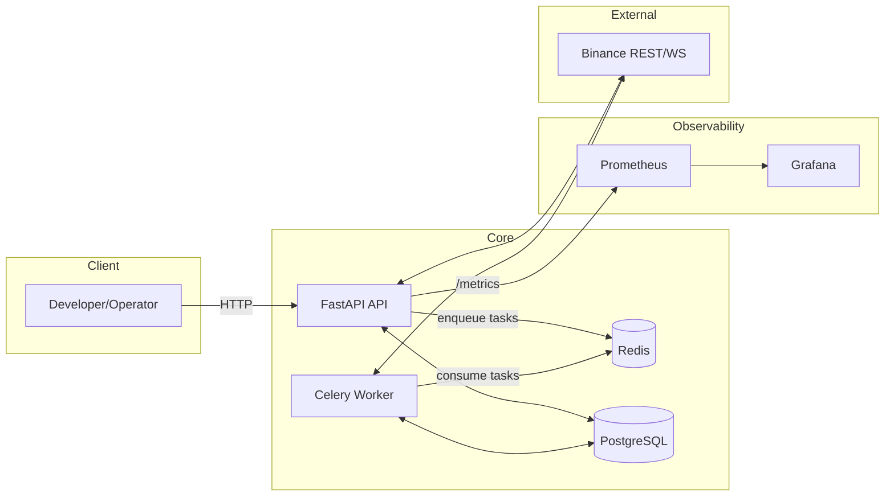

## Arquitectura (Mermaid)

```mermaid
flowchart LR
  subgraph Client
    Dev[Developer/Operator]
  end

  Dev -->|HTTP| API

  subgraph Core
    API[FastAPI API]
    Worker[Celery Worker]
    Redis[(Redis)]
    DB[(PostgreSQL)]
  end

  subgraph Observability
    Prom[Prometheus]
    Graf[Grafana]
  end

  subgraph External
    Binance[Binance REST/WS]
  end

  API -->|enqueue tasks| Redis
  Worker -->|consume tasks| Redis
  API <--> DB
  Worker <--> DB
  API <--> Binance
  Worker <--> Binance
  API -->|/metrics| Prom
  Prom --> Graf
```

