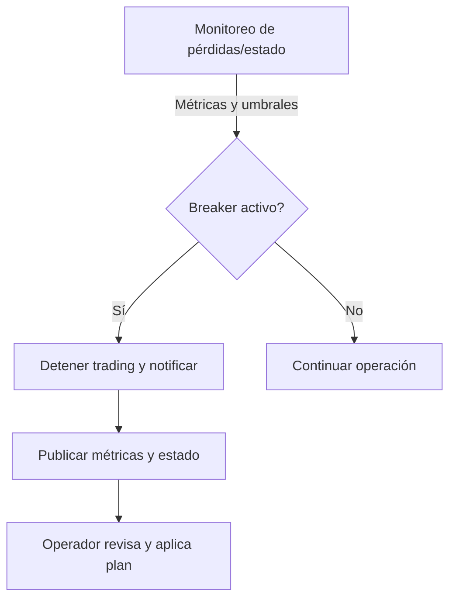

## Flujo de Emergency / Circuit Breakers (Mermaid)

```mermaid
flowchart TD
  A[Monitoreo de pérdidas/estado] -->|Métricas y umbrales| B{Breaker activo?}
  B -- Sí --> C[Detener trading y notificar]
  B -- No --> D[Continuar operación]
  C --> E[Publicar métricas y estado]
  E --> F[Operador revisa y aplica plan]
```

