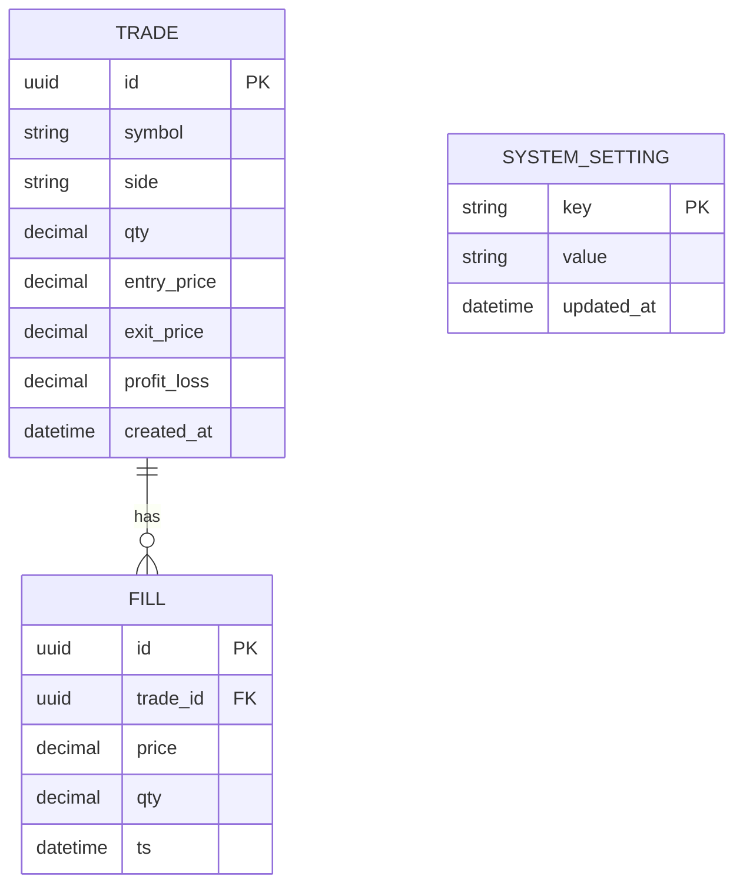

## ERD Simplificado (Mermaid)

```mermaid
erDiagram
  TRADE ||--o{ FILL : has
  TRADE {
    uuid id PK
    string symbol
    string side
    decimal qty
    decimal entry_price
    decimal exit_price
    decimal profit_loss
    datetime created_at
  }
  FILL {
    uuid id PK
    uuid trade_id FK
    decimal price
    decimal qty
    datetime ts
  }
  SYSTEM_SETTING {
    string key PK
    string value
    datetime updated_at
  }
```
