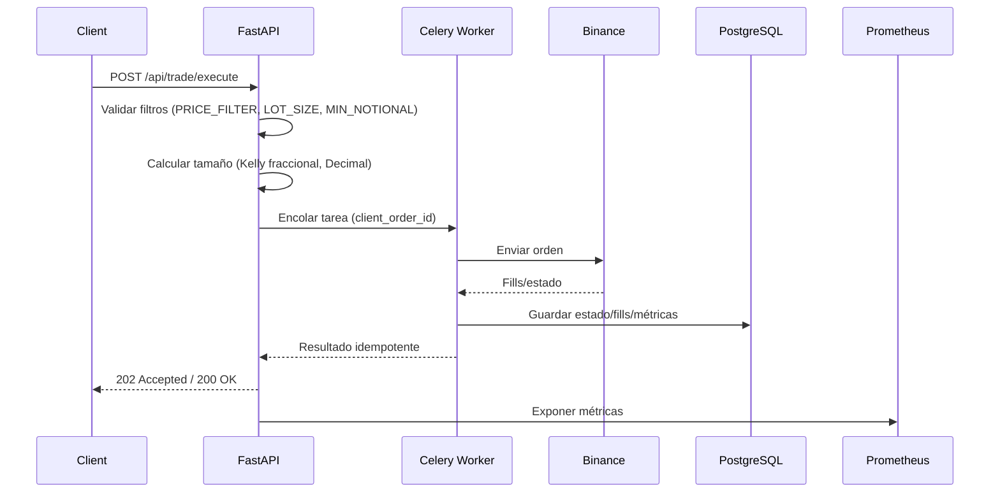

## Secuencia E2E de Orden (Mermaid)

```mermaid
sequenceDiagram
  participant Client
  participant API as FastAPI
  participant Worker as Celery Worker
  participant Binance
  participant DB as PostgreSQL

  Client->>API: POST /api/trade/execute
  API->>API: Validar filtros (PRICE_FILTER, LOT_SIZE, MIN_NOTIONAL)
  API->>API: Calcular tamaño (Kelly fraccional, Decimal)
  API->>Worker: Encolar tarea (client_order_id)
  Worker->>Binance: Enviar orden
  Binance-->>Worker: Fills/estado
  Worker->>DB: Guardar estado/fills/métricas
  Worker-->>API: Resultado idempotente
  API-->>Client: 202 Accepted / 200 OK
  API->>Prometheus: Exponer métricas
```
